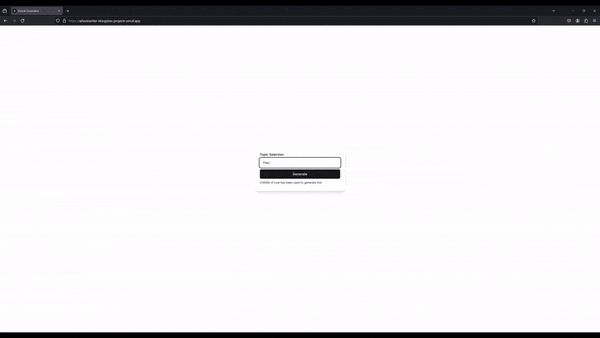

[Deployment](https://aibookwriter-kkingsbes-projects.vercel.app/)

# Welcome
This is just a simple experiment I made in an afternoon to see if it was feasible to write longer pieces of text with gpt-4o. There is a basic frontend for setting the initial topic, viewing the outline, and viewing the final book (with cover & image).

## Example Output

## High-level Technical Synopsis
This project consists of two separate services; a NextJS frontend and a NestJS backend. I chose to not implement the backend logic in NextJS as Vercel has a limit of 15 seconds for an api route (IIRC, I didn't bother to check). Also allows for a better separation of concerns, and NestJS is just more productive to work in IMO.

## Running
1. `npm install` within both `/ebook-generator` and `/ebook-generator-backend`
2. `npm run build` within `/ebook-generator-backend`
3. `npm run start` within `/ebook-generator-backend`
4. `npm run dev` within `/ebook-generator`

### Notes:
Make sure to start the backend service before the frontend if you intend to run both on the same machine, as NestJS does not appear to have the logic for selecting another port if the default port (3000) is in use.
